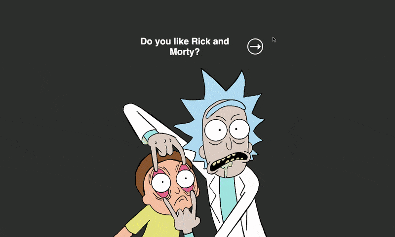
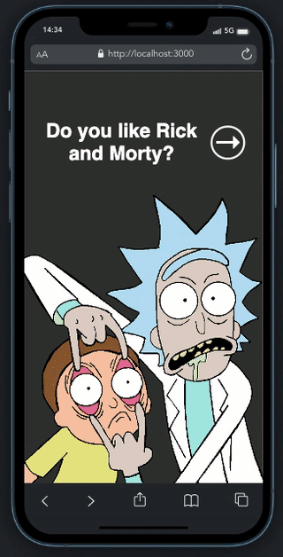
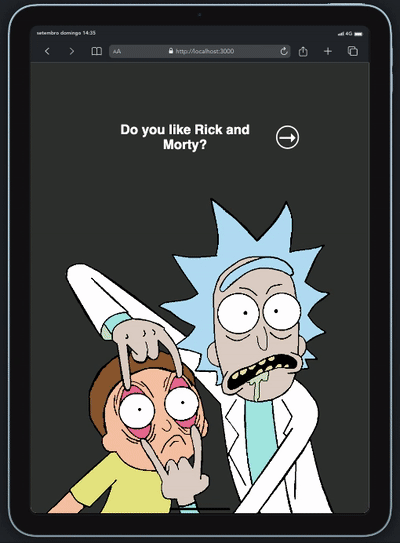

## Rick 'n Morty Page

<i>Projeto desenvolvido como desafio referente ao módulo 2 do curso Vai na Web de desenvolvimento front-end. </i>  

    
    
    
    

 

Nesse projeto, desenvolvi um design simples para exibição de algumas informações consumidas com a <a href="https://rickandmortyapi.com">The Rick and Morty API</a>.

O projeto ainda carece de responsividade para dispositivos em landscape mode e, como aperfeiçoamento futuro, pretendo exibir maior range de personagens em sistema de paginação.

## PREVIEW

  

  
  

 

    

